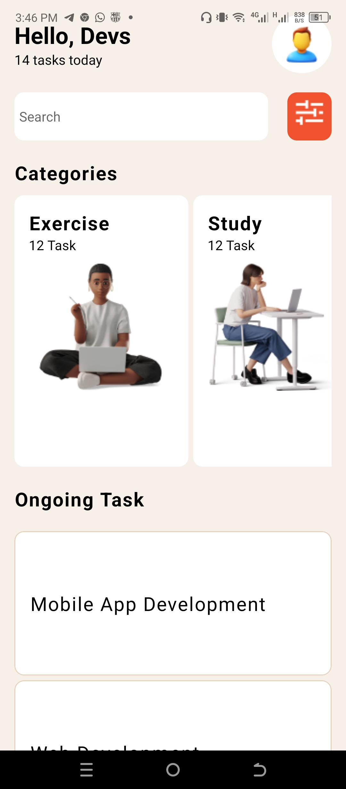
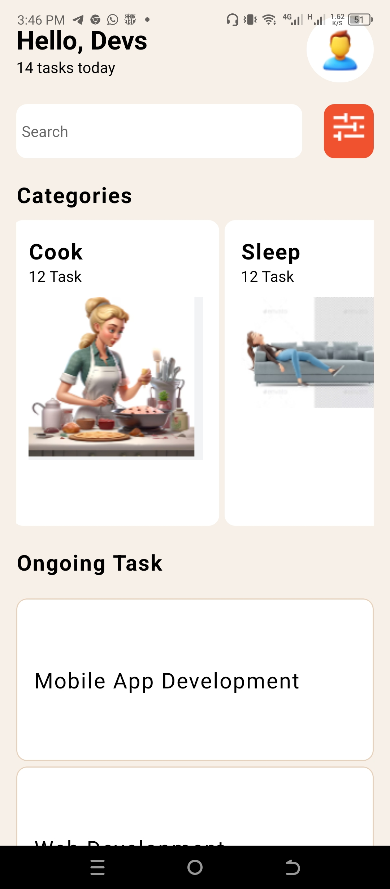
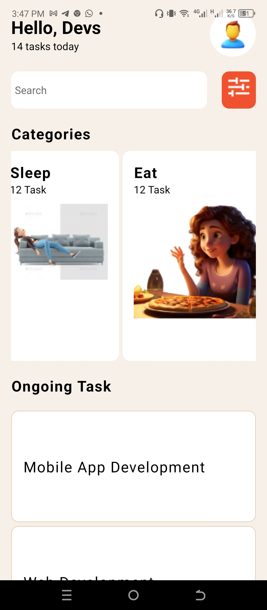
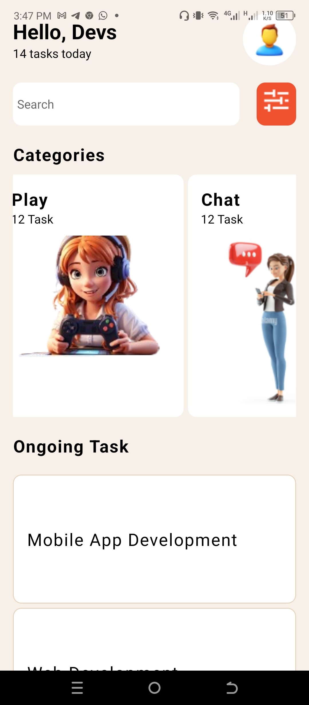
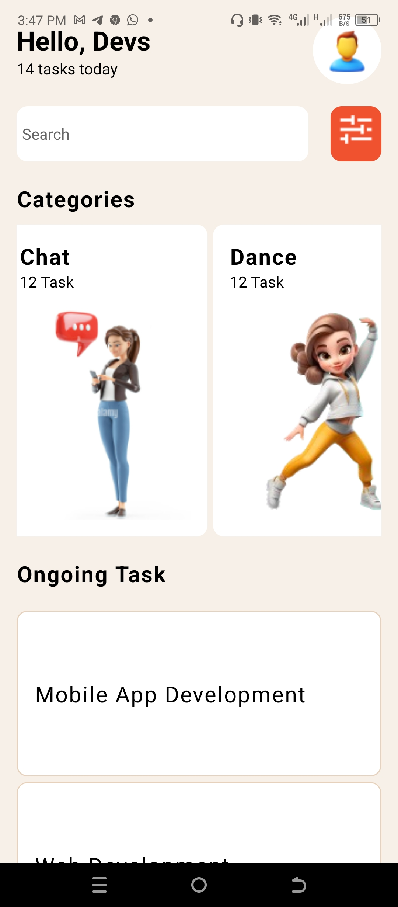
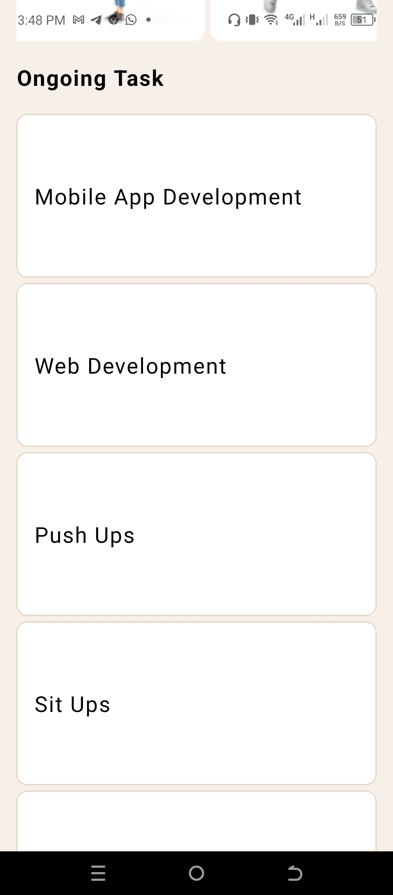
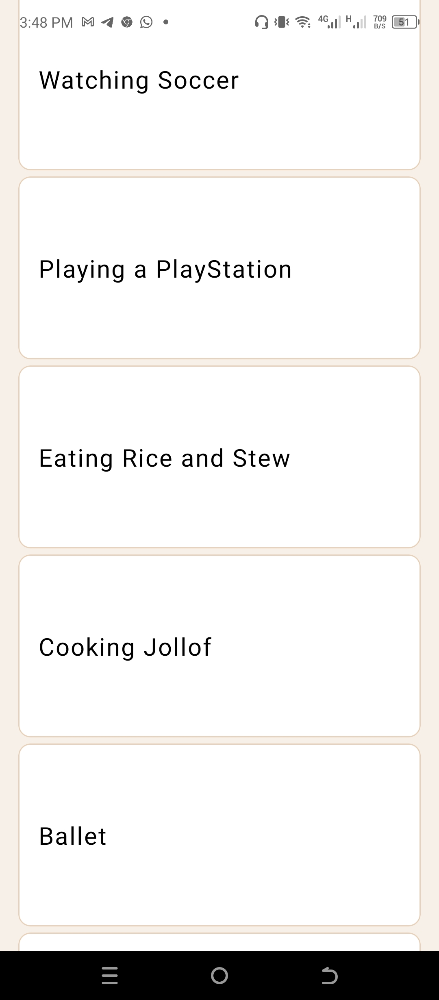
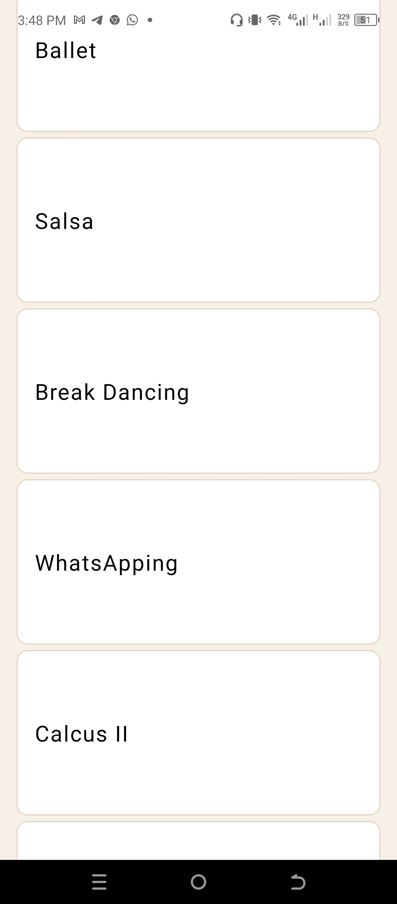
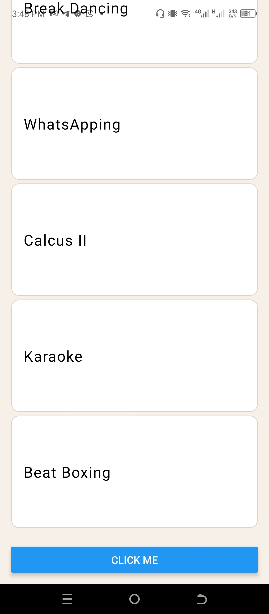

# rn-assignment3-11019735

## Student ID -110119735

# Use of The Components Employed In The App

## View

It serves as a container to help structure and style my UI components.

## Text

The text component helps in displaying texts.

## ScrollView

It creates a page or view that can be scrollable when the content of the page is too large to fit into the available space.

## StyleSheet

It helps organize my styles or css.

## Button

The button component creates a clickable button which triggers an action when pressed.

## FlatList

The FlatList component helps render a list of items.

## Image

The Image component helps in displaying images.

## TouchableOpacity

This component provides a visual feedback to a user when the item on which it is applied to is touched.

# Screenshots

